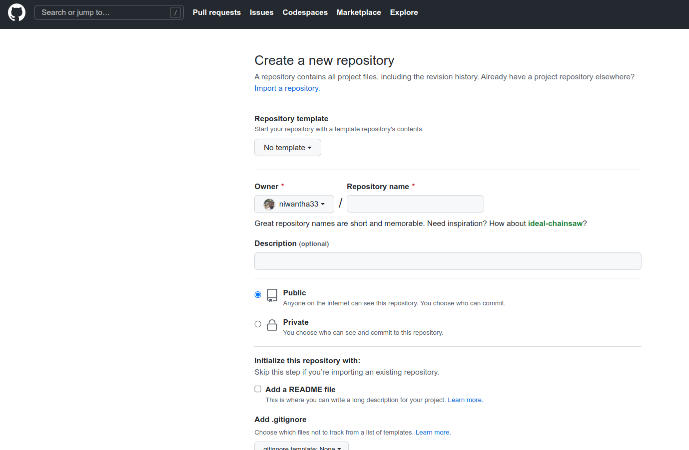
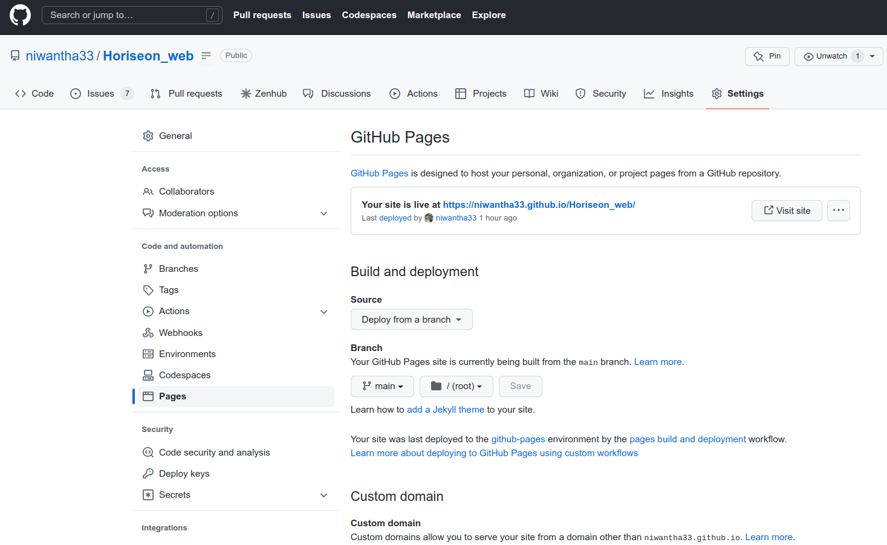
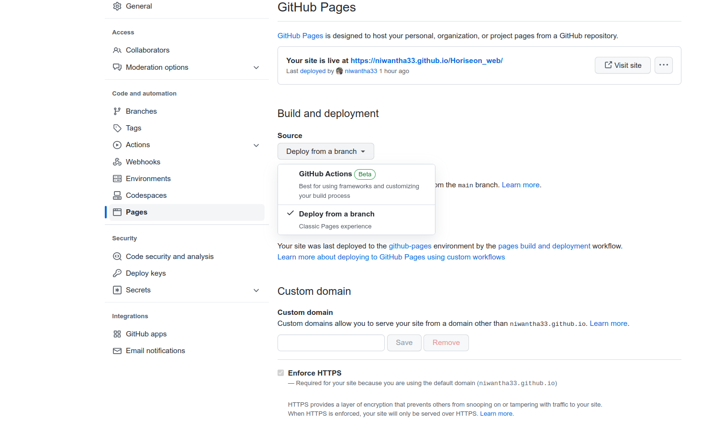
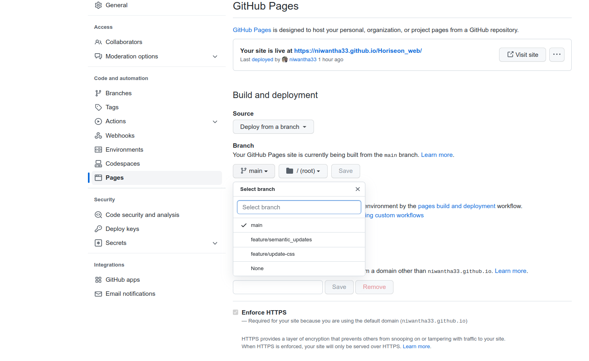
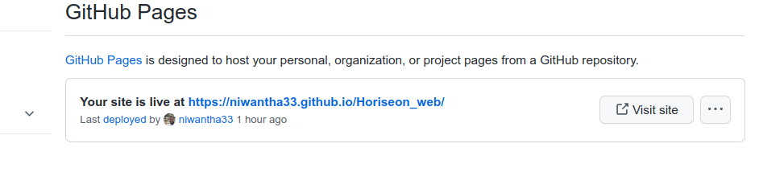
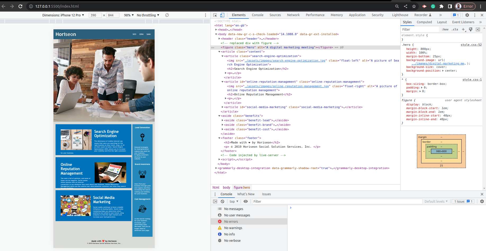

# Improve Accessibility Of the Site. 

## Description

What motivated me to do this project was it's current status of limited accessibility.I wanted to improve the accessibility so that it will increase the and search engine optimization.Since the existing code was developed using non-semantic elements and without accessibility feature, the site's SEO was limited.By building this project, the site will standout amongst its competitors and will be easy access to anyone including people with special needs.

While working in this project, I learnt HTML semantic elements, accessibility features and SEO. 

<iframe src="https://drive.google.com/file/d/1sZ4yLzga6-2co6vJI9VGRmhPCKEkcSXf/preview" width="640" height="480"></iframe>

## Table of Contents (Optional)

- [Installation](#installation) 
- [Usage](#usage)
- [Credits](#credits)
- [License](#license)

## Installation

<iframe src="https://drive.google.com/file/d/1sZ4yLzga6-2co6vJI9VGRmhPCKEkcSXf/preview" width="640" height="480"></iframe>

1. create repo

2. go to Settings->Pages

3. then click source 

4. select branch 

5. site
 

## Usage

## Credits
[Semantic HTML](https://www.w3schools.com/html/html5_semantic_elements.asp)
[Image alt attributes](https://www.w3schools.com/tags/att_img_alt.asp)

## License

NA

## Tests

 